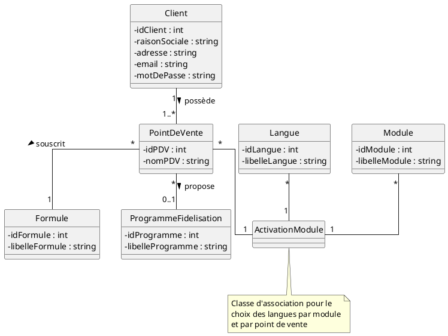

# Cas WebCaisse – Réponses 

### BTS SIO Option SLAM – 2ème année

---

# Mission 1 – Souscription en ligne et Sécurité

## 1.1 – Modifier la structure de la base de données



---

## 1.2 – Faille de sécurité et processus d'inscription sécurisé

L'envoi du mot de passe par mail est une faille critique du critère **Confidentialité** (DICP) et viole le RGPD. Les mails transitent souvent en clair sur des serveurs intermédiaires — une interception permettrait un accès direct au compte. De plus, ça implique que le mot de passe est stocké lisible en base, ce qui expose tous les clients en cas de fuite.

**Processus sécurisé :** Le client choisit lui-même son mot de passe sur un formulaire (stocké hashé avec bcrypt). Le système génère ensuite un **token unique et temporaire** envoyé par mail sous forme de lien d'activation pour vérifier son identité.

---

## 1.3 – Structure de FormuleSouscrite et historique

La structure actuelle ne permet pas de facturation au prorata : tout `UPDATE` écrase l'ancienne formule sans laisser de trace. Sans dates de début et de fin, impossible de savoir sur quelle période chaque formule était active pour calculer la facture mensuelle.

---

## 1.4 – Correction de la structure

Créer une table `Historique_Formule` avec les colonnes `id_pdv`, `id_formule`, `date_debut_activation`, `date_fin_activation` (nulle si formule en cours). Clé primaire composite : `(id_pdv, date_debut_activation)`.

---

## 1.5 – Trigger SQL

```sql
DELIMITER //
CREATE TRIGGER tg_audit_changement_formule
AFTER UPDATE ON PointDeVente
FOR EACH ROW
BEGIN
  IF OLD.idFormule <> NEW.idFormule THEN
    INSERT INTO AuditFormule (idPointDeVente, ancienneFormule, nouvelleFormule, dateChangement)
    VALUES (OLD.id, OLD.idFormule, NEW.idFormule, NOW());
  END IF;
END //
DELIMITER ;
```

---

# Mission 2 – Fidélisation et Robustesse

## 2.1 – Requêtes SQL

**a) Consommateurs ayant eu au moins une vente en 2017**

```sql
SELECT DISTINCT c.nom, c.prenom, c.mail
FROM Conso c
JOIN Vente v ON c.id = v.idConso
WHERE YEAR(v.dateVente) = 2017;
```

**b) Nombre de consommateurs fidélisés entre 18 et 30 ans**

```sql
SELECT COUNT(*)
FROM ConsoFidele
WHERE TIMESTAMPDIFF(YEAR, dateNaiss, CURDATE()) BETWEEN 18 AND 30;
```

**c) Liste des consommateurs avec le montant total de leurs ventes**

```sql
SELECT c.nom, c.prenom, SUM(v.montantVente) AS TotalVentes
FROM Conso c
JOIN Vente v ON c.id = v.idConso
GROUP BY c.id, c.nom, c.prenom;
```

---

## 2.2 – Faille OWASP

C'est une faille d'**Injection SQL**. En concaténant directement la variable `seuilVentes` dans la requête, on laisse la porte ouverte. Une personne pourrait taper du code SQL au lieu d'un nombre (ex: `' OR 1=1 --`) pour contourner la condition et manipuler la base.

---

## 2.3 – Sécurisation avec PreparedStatement

```java
String requete = "SELECT c.nom, c.prenom, c.tel, c.mail "
    + "FROM Conso c "
    + "JOIN Vente v ON c.id = v.idConso "
    + "WHERE c.id NOT IN (SELECT id FROM ConsoFidele) "
    + "AND v.dateVente BETWEEN ? AND ? "
    + "GROUP BY c.id, c.nom, c.prenom, c.tel, c.mail "
    + "HAVING COUNT(v.id) > ?";

PreparedStatement pstmt = this.dbConnect.prepareStatement(requete);
pstmt.setDate(1, java.sql.Date.valueOf(dateDeb));
pstmt.setDate(2, java.sql.Date.valueOf(dateFin));
pstmt.setInt(3, seuilVentes);
ResultSet res = pstmt.executeQuery();
```

---

## 2.4 – Test unitaire testInitConso

```java
assertEquals("erreur calcul initialisation", 0.0, consoTest.getPointsFidelite());
```

---

## 2.5 – Test unitaire testAddMontant

```java
consoTest.addFidelite(3, 150);
assertEquals("erreur calcul 1er achat", 10.0, consoTest.getPointsFidelite());

consoTest.addFidelite(3, 300);
assertEquals("erreur calcul 2ème achat", 30.0, consoTest.getPointsFidelite());

consoTest.addFidelite(3, 600);
assertEquals("erreur calcul 3ème achat", 80.0, consoTest.getPointsFidelite());
```

---

# Mission 3 – Statistiques de ventes (POO)

## 3.1 – Javadoc de statVente

```java
/**
 * Calcule le pourcentage de ventes réalisées par des clients fidèles.
 *
 * @param lesVentesDuJour Liste des ventes à analyser.
 * @return Le pourcentage de ventes des clients fidèles.
 */
```

---

## 3.2 – Méthode getNbVentes

```java
public int getNbVentes() {
    return this.lesVentes.size();
}
```

---

## 3.3 – Constructeur VenteEcommerce

```java
public VenteEcommerce(Date uneDateVente, Conso unConso, double unMontant,
    String adresseLivraison, String optionLivraison) {
    super(uneDateVente, unConso, unMontant);
    this.adresseLivraison = adresseLivraison;
    this.optionLivraison = optionLivraison;
}
```

---

## 3.4 – Compléter compareLieuVente avec instanceof

```java
for (Vente uneVente : cf.getVentes()) {
    if (uneVente instanceof VenteEcommerce) {
        totalEcom += uneVente.getMontantVente();
    } else if (uneVente instanceof VenteMagasin) {
        totalMag += uneVente.getMontantVente();
    }
}
```

---

## 3.5 – Division par zéro et correction

La division `totalMag / totalEcom` est dangereuse : si aucune vente en ligne n'a eu lieu, `totalEcom` vaut 0 et le programme plante avec une `ArithmeticException`. Correction :

```java
if (totalEcom == 0) {
    return 0;
}
return totalMag / totalEcom;
```

---

## 3.6 – Méthode getVentesSup

```java
public ArrayList<Vente> getVentesSup(double montantMin) {
    ArrayList<Vente> resultat = new ArrayList<Vente>();
    for (Vente v : this.lesVentes) {
        if (v.getMontantVente() > montantMin) {
            resultat.add(v);
        }
    }
    return resultat;
}
```

---

# Mission 4 – Bac à Sable (JavaFX + JDBC)

- **4.1** Déploiement de la base de données (DDL et DML)
- **4.2** La classe Modèle (`Conso.java`)
- **4.3** Accès aux données sécurisé – `GrcDAO.java` avec `PreparedStatement`
- **4.4** La vue FXML – `recherche.fxml`
- **4.5** Le contrôleur JavaFX – `RechercheController.java`
- **4.6** Configuration et démarrage Maven – `pom.xml` + `Launcher.java`

> Projet fonctionnel disponible sur GitHub : [project-webcaissesSIO2](https://github.com/tanaa75/project-webcaissesSIO2)

---

# Questions complémentaires – Architecture Java, SQL et Sécurité

**1. NF525 et WebCaisse**
La norme impose que les données de caisse soient infalsifiables. WebCaisse ne peut donc pas permettre la suppression ou modification d'une vente. Ça oblige à concevoir des logs sécurisés et des clôtures de journée certifiées.

**2. Envoi d'identifiants par mail**
Un mail peut être intercepté sur des serveurs intermédiaires. Si le mot de passe est en clair, n'importe qui y ayant accès peut s'en emparer. Ça viole la **Confidentialité** (DICP) et le RGPD.

**3. Structure de FormuleSouscrite et historique**
Avec `(idPointDeVente, idFormule)` comme clé primaire, on ne peut pas avoir deux lignes avec le même couple. Et sans dates, impossible de savoir sur quelle période facturer au prorata.

**4. Intérêt d'un Trigger**
Le trigger s'exécute directement dans la base, même si quelqu'un modifie les données en dehors de l'application. La traçabilité est donc garantie dans tous les cas.

**5. WHERE vs HAVING**
`WHERE` filtre les lignes **avant** le regroupement. `HAVING` filtre **après**, sur le résultat des fonctions d'agrégation. On ne peut pas écrire `WHERE COUNT(*) > 2`, il faut `HAVING COUNT(*) > 2`.

**6. Injection SQL par concaténation**
Si `seuilVentes` vaut `0 OR 1=1 --`, la requête devient toujours vraie. Un attaquant pourrait même écrire `; DROP TABLE Conso; --` pour détruire des données.

**7. PreparedStatement vs Statement**

- Sécurité : paramètres automatiquement échappés, pas d'injection possible.
- Performance : requête précompilée par le SGBD.
- Lisibilité : données séparées de la requête SQL.

**8. instanceof dans compareLieuVente**
`instanceof` permet de déterminer le type exact d'une vente à l'exécution. Mais c'est une mauvaise pratique en POO : il vaudrait mieux créer une méthode `getLieu()` dans la classe mère et la surcharger dans chaque sous-classe.

**9. Division par zéro**
Si aucune vente en ligne n'a eu lieu, `totalEcom` vaut 0 et le programme plante avec une `ArithmeticException`. Un programme robuste doit toujours anticiper ce cas avec une condition de garde avant le calcul.

**10. Rôle de Launcher et Main**
Depuis Java 11+, lancer directement une classe `extends Application` depuis un JAR peut poser des problèmes de modules JavaFX. `Launcher` appelle `Main.main(args)` de façon indirecte, ce qui assure un démarrage propre.

---

*CA TANAVONG – SIO2 SLAM*
